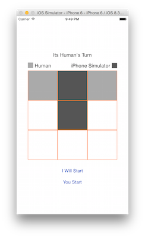

# Tic-Tac-Toe-Objc
Introduction Project on iPhone App with Single Player Tic-Tac-Toe against Device. Where Device Always wins or ties, but never loses

Features:

1. Support Both iPhone / iPad
2. Allow a Single player (I called him Human) to play Tic-Tac-Toe against the device. Use "I will Start" or "You Start" buttons
3. Human can either chose himself  to start or allow device to take first turn
4. Device will always try to win, But if Human is smart, it tries to Draw/Tie the game
5. If the device takes turn first, then It will always win except if Human takes center spot on his first move.
6. At any time, Human can restart the game by either tapping "I will Start" or "You Start" button placed below the board
